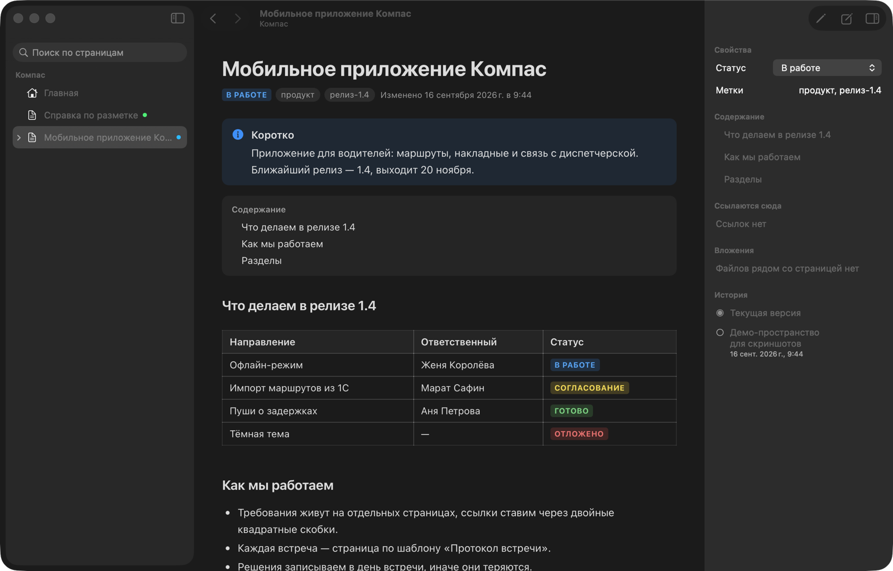
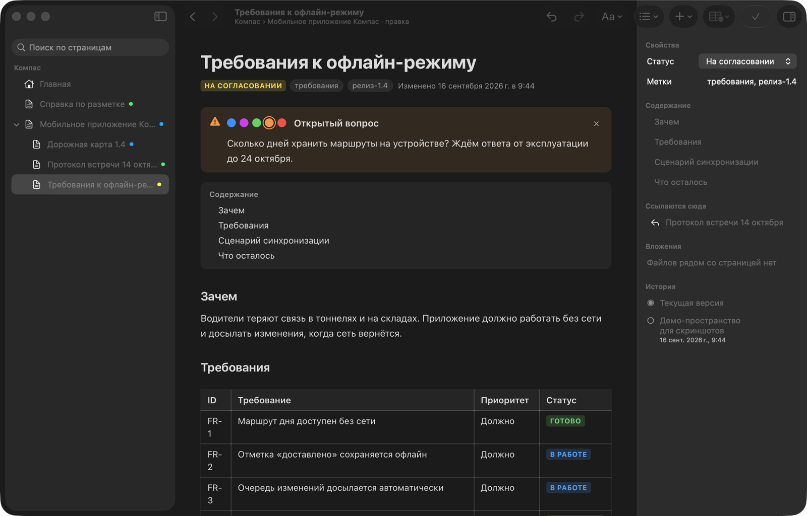
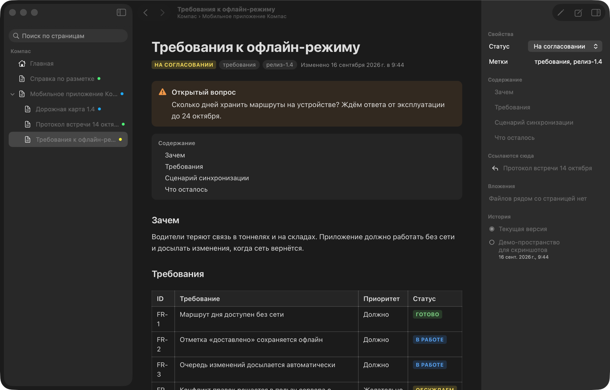

<p align="center"></p>

<h1 align="center">Folio</h1>

<p align="center">Локальная вики в духе Confluence для macOS.<br>Страницы лежат Markdown-файлами у вас на диске, у каждого пространства своя история в git.</p>

<p align="center">
  
  
  
</p>

<p align="center"><b><a href="https://github.com/Arti-Ko/folio/releases/latest/download/Folio.dmg">⬇ Скачать Folio.dmg</a></b> · <a href="https://github.com/Arti-Ko/folio/releases">все выпуски</a></p>



## Зачем

Рабочую базу знаний удобно вести как в Confluence: дерево страниц, панели, статусы, таблицы, ссылки между страницами. Только всё это не обязано жить на чужом сервере.

В Folio страница — это папка с файлом `index.md`. Файлы читаются глазами и любым редактором, лежат в вашей папке, версии хранит git. Приложение добавляет к ним визуальный редактор, поиск, обратные ссылки и историю.

## Возможности

### Страницы как обычные файлы

Пространство — папка со своим git и своим `CLAUDE.md`, где записаны правила разметки. Рабочие материалы не смешиваются с личными, а любое пространство можно перенести на другой Mac простым копированием папки.

```
~/Folio/Работа/
├── CLAUDE.md
├── Мобильное приложение Компас/
│   ├── index.md
│   ├── схема-синхронизации.png
│   └── Требования к офлайн-режиму/
│       └── index.md
└── _Шаблоны/
```

### Визуальный редактор

⌘E — и страница становится редактируемой: форматирование, таблицы, панели, статусы, списки задач. Меню по `/`, ссылки на страницы по `[[`, картинки вставляются из буфера обмена и сохраняются рядом со страницей. Текст сохраняется сам, а по кнопке «Готово» уходит снимок в историю git.



### Ссылки, обратные ссылки, вложения

Ссылка `[[Заголовок]]` не ломается при переносе страницы, а при переименовании чинится во всех пространствах сразу. В инспекторе справа видно, кто ссылается на эту страницу, какие файлы лежат рядом и какие были версии.



### Поиск и история

Поиск идёт по тексту всех пространств, в том числе по части слова и по-русски без учёта регистра. История — обычные коммиты git: старую версию можно открыть и сравнить с текущей.

### Элементы Confluence

Панели `info`, `note`, `success`, `warning`, `error`, раскрывающиеся блоки, статусы, оглавление, список дочерних страниц, таблицы и задачи. Шаблоны: протокол встречи, требования, техническое задание.

### Утилита командной строки

Устанавливается из **Folio → Настройки → Командная строка**. Удобно, когда страницы готовит скрипт или ИИ-агент.

| Команда | Что делает |
| --- | --- |
| `folio tree` | Дерево страниц пространства |
| `folio new "Заголовок" --parent "Раздел"` | Создать страницу, в том числе по шаблону |
| `folio search "текст"` | Поиск по всем пространствам |
| `folio open "Заголовок" --edit` | Открыть страницу в приложении сразу на правку |
| `folio rename`, `folio move`, `folio delete` | Переименовать, перенести, удалить — со ссылками |
| `folio backlinks "Заголовок"` | Кто ссылается на страницу |
| `folio history`, `folio commit -m "…"` | История и снимок изменений |
| `folio check` | Дубли заголовков, битые ссылки, потерянные вложения |

## Установка

1. Откройте `Folio.dmg` и перетащите Folio в «Программы».
2. Приложение не заверено у Apple, поэтому при первом запуске macOS его остановит: **Системные настройки → Конфиденциальность и безопасность → «Всё равно открыть»**. Или в Терминале: `xattr -dr com.apple.quarantine /Applications/Folio.app`.
3. При первом запуске Folio предложит создать пространства «Работа» и «Личное» в `~/Folio`. Не в «Документах»: к ним macOS спрашивает доступ заново после каждого обновления неподписанного приложения.

Требования: macOS 26 Tahoe и Mac на Apple Silicon.

## Обновления

Folio проверяет [GitHub Releases](https://github.com/Arti-Ko/folio/releases) при запуске и каждые 6 часов. Новая версия скачивается в фоне и ставится, когда вы закрываете приложение; чтобы обновиться сразу, нажмите «Перезапустить для версии X» внизу боковой панели.

Если в **Настройки → Обновления** выключить автоматическую установку, вместо этого появится окно с описанием изменений. Проверить вручную — **Folio → Проверить обновления…**.

## Как выглядит страница

```markdown
---
id: 3f9c2a7b1d04
title: Требования к офлайн-режиму
status: На согласовании
labels: [требования, релиз-1.4]
---

:::warning {title="Открытый вопрос"}

Сколько дней хранить маршруты на устройстве? Ждём ответа от эксплуатации.

:::

[toc]

## Требования

| ID   | Требование                    | Статус                                 |
| ---- | ----------------------------- | -------------------------------------- |
| FR-1 | Маршрут дня доступен без сети | [status color="green"]Готово[/status]  |
| FR-2 | Отметка сохраняется офлайн    | [status color="blue"]В работе[/status] |

Подробности — в [[Дорожная карта 1.4]].
```

Полные правила разметки — в `CLAUDE.md`, который создаётся в каждом пространстве, и на странице «Справка по разметке».

## Разработка

```sh
Scripts/build.sh              # dist/Folio.app
Scripts/build.sh --install    # в /Applications и ссылка folio в /opt/homebrew/bin
Scripts/package.sh            # dist/Folio.dmg и dist/Folio.zip
Scripts/make-icon.sh          # Assets/AppIcon.icns
Scripts/release.sh 0.2.0      # тег → GitHub Actions соберёт и опубликует выпуск
```

Тесты: `swift test` и `cd web && npm test`. Если глобальный git настроен с `safe.bareRepository=explicit`, SwiftPM нужен обход: `GIT_CONFIG_COUNT=1 GIT_CONFIG_KEY_0=safe.bareRepository GIT_CONFIG_VALUE_0=all swift test`.

Устройство: `Sources/FolioCore` — модель страниц, индекс поиска, git, обновления; `Sources/FolioCLI` — утилита `folio`; `Sources/FolioApp` — приложение SwiftUI; `web/` — отрисовка и правка страниц на TipTap внутри WKWebView.

Скриншоты в этом файле сняты на демонстрационном пространстве с вымышленными данными.
